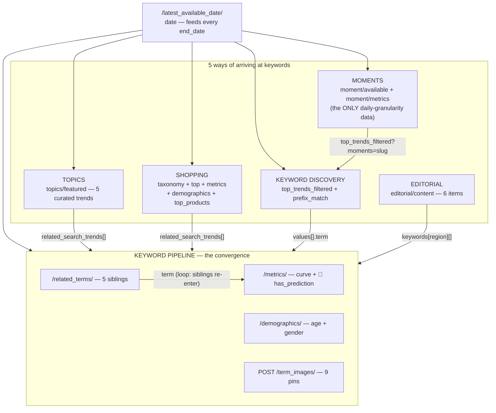

# ARCHITECTURE — the endpoint graph and the product built on it

> This document is the bridge between the wire reference
> ([07-API-REFERENCE.md](wire/07-API-REFERENCE.md)) and the code — it answers three
> questions the endpoint docs cannot: **how the endpoints link**, **what a
> customer actually buys**, and **how a run flows through the layers**. Written
> 2026-08-19 as the design; **the design is now implemented** — all four layers
> built (§3.2), five operations verified live, 566 checks. Where
> this doc and `src/` disagree, that is a bug in one of them: fix it in the
> same commit, the same rule as wire-vs-doc.

---

# 1. The core insight the UI hides

The sidebar shows **3 pages**. The wire shows **5 independent datasets that all
funnel into one keyword pipeline**. The UI is a remix — the Trend-overview page
alone touches 11 endpoints from 4 datasets, and the `/search` page secretly calls
`moment/available` just to fill a filter dropdown.

**Build against the graph, never against the pages.**

The second insight — and the reason this product is worth paying for — is that
**most of the valuable data is invisible until you traverse to it**. Nothing on
any Pinterest page shows you "Mascaras' search queries with forecast flags". That
record only exists after a 4-step traversal:

```
shopping/top (vertical 1250)      "Mascaras is trending, id 1311"
  └► demographics (id 1311)       17 related_search_trends — HIDDEN until this call
       └► /metrics/ (those terms) growth curves + has_prediction per term
            └► has_prediction?    🔮 true → 91-day forecast · false → rank on growth
```

Every operation below is a packaged traversal like that one. The customer buys the
walk, not the endpoints.

---

# 2. THE GRAPH

## 2.1 Nodes — 5 datasets + the pipeline they all feed



## 2.2 Edges — which output field feeds which input param

This table **is** the map. Every edge was verified on the wire.

| From (response field) | To (request param) | Notes |
|---|---|---|
| `latest_available_date.date` | `end_date` / `endDate` everywhere | never `today()` — data lags, future dates 400 |
| `moment/available.moments[i]` (slug) | `moment/metrics.moments[]` | multi supported |
| `moment/available.moments[i]` | `top_trends_filtered?moments=` | ⚠️ slugs are **region-specific** — validate against that region's list |
| `taxonomy.categories{id}.friendly_name` | — (join only) | every shopping response returns IDs, never names |
| *hardcoded L1 verticals* (7 return data: `1181,1250,1042,1148,1016,1500,1315`) | `top.parent_product_categories` | ⚠️ NOT from the taxonomy — taxonomy has no L1; L2/L3 here → silent 0 rows |
| `top.ordered_values[].product_category` (id) | `metrics.product_category_ids[]`, `demographics.product_category_ids[]`, `top_products.product_category_id` | the drill-down spine |
| `top.ordered_values[].related_search_trends[]` (~24 strings) | keyword pipeline `terms` | free keywords, no extra call |
| `demographics.related_search_trends[]` (~17 strings) | keyword pipeline `terms` | identical across all 3 events — request once |
| `topics/featured[].related_search_trends[]` (~12) | keyword pipeline `terms` | |
| `editorial[].keywords[REGION][]` | keyword pipeline `terms` | nested per region — pick yours, no flat list |
| `top_trends_filtered.values[].term` | `metrics.terms`, `demographics.terms`, `related_terms.requestTerm`, `term_images.terms` | the main funnel |
| `prefix_match[].term` | same four | searches the WHOLE keyword space, not just trending |
| `related_terms[].term` | back into the pipeline | the loop edge — siblings re-enter |
| `metrics[].has_prediction` | *decision, not a param* | see §2.3 |
| *hardcoded 24 interest IDs* | `topics/featured.interests` (exactly one), `top_trends_filtered.l1interests` (comma list) | homepage filter shows 16, `/search` shows 24 — same ID space |

**Join keys, ranked by reach:** keyword string (universal) → region → interest ID
→ moment slug → category ID (shopping-only, needs the taxonomy join).

## 2.2b Walking the edges — the `crawl` operation

For most of this project the table above was a **map nobody walked**. The four
operations each traverse a fixed slice of it and stop; the edges they cross on
the way out — `related_search_trends`, `editorial[].keywords`,
`related_terms[].term`, the one this document already labelled *"the loop edge
— siblings re-enter"* — were parsed, emitted on the record, and never followed.

`crawl` (`src/crawl.py`) follows them. It is the same graph; the difference is
that traversal is now driven by the edges rather than hardcoded per operation.

**Entry points** are Pinterest's own pages, because "where do I start" is a
navigation question, not a data one:

| `crawlFrom` | Loads | Then follows |
|---|---|---|
| `overview` | spotlight + editorial + every moment | their `keywords` |
| `shopping` | trending product categories | each category's `search_queries` chips |
| `search` | trending search keywords | each keyword's `related` |
| `moments` | every seasonal moment | each moment's `keywords` |

**The traversal order is the whole design.** Breadth-first, batched per level —
never depth-first per node:

```
depth-first, per node     13 moments x 25 keywords x 3 calls   ~975 requests
breadth-first, per level  the same 74 nodes                    ~17 requests
```

The keyword endpoints take arrays (§2.2: `metrics.terms`,
`demographics.terms`), so one call answers for a whole level. Cost scales with
**depth**, not with how many nodes the level holds. A depth-first crawler over
this graph would be correct and unusable on a session shared by every customer.

The one edge that does **not** batch is `related_terms` — one request per term.
So it is fetched only when a deeper level will actually consume it, capped by
`relatedFanout`. Getting this wrong made `crawlDepth: 2` silently return depth
1's result: the level was enriched without edges, the frontier came back empty,
and the crawl stopped *while reporting success*.

**Two guards**, because this is the one operation that can run away:

- `maxRequests` caps what is **followed**. The entry page always loads in full
  — half an entry page is a wrong answer, not a cheaper one — so its cost is a
  reported floor (`entry_cost`), not something the budget can prevent.
- every node is visited once, keyed by `(kind, id)`. `mascara` reached from
  three categories is one keyword, and a keyword never collides with a category
  of the same name.

**Every crawl ends with a `crawl_summary` record.** Records stream as they are
found, so one emitted early cannot know the crawl was cut short later. The
summary is written last and carries nodes-by-kind, requests spent vs budget,
the entry floor, `truncated`, and how many edges were left unfollowed. Without
it a truncated crawl is indistinguishable from a complete one — the same
silent-empty failure this codebase refuses everywhere else.

## 2.3 Decision nodes — where the traversal branches

These are the points where the *response* decides the next call. They are the
logic a coding agent must implement exactly:

**Growth `{value, index}` pairs (settled 2026-08-19):** `index` is the 1..N rank
of the value within its response — response-scoped, exposed as
`*_rank_in_response`, never comparable across responses.

**🔮 `has_prediction` (per keyword × region, never changes with dates)**
```
true  → the crystal ball exists. predicted_days=91 fills
        predictedUpper/LowerBoundNormalizedCount. US-only in practice.
false → NO forecast exists. Do NOT retry with other params (verified inert).
        Rank on growth_rates + seasonality_score instead,
        and check /related_terms/ — a sibling may have one (does not propagate).
```
There is no server-side "only forecastable" filter — reproducing the crystal
ball costs **1 + N** requests. That cost is a *feature* of our product: we pay
it once and ship the flag on every record.

**Moment phase (`phase_labels[i]`)**
```
rising | approaching → worth acting on: pull moment/metrics + moment keywords
cooldown | off_season | ended → record the phase, skip the expensive calls
```

**Empty ≠ error (three flavors, all verified)**
```
top_products with event≠OUTBOUND_CLICK → 200 + []   (wrong param, silent)
top/ with an L2/L3 id                  → 200 + 0 rows (wrong level, silent)
editorial for FR                       → 200 + 0 items (region unsupported)
```
Each must surface as `unsupported`/`no_data` with the reason — never as `[]`
that a customer reads as "nothing is trending".

**Moment demographics — CAPTURED 2026-08-19, now measured**
```
A persisted GraphQL POST, no REST equivalent — but reproducible from a leased
session (doc #7 §3.18). audience_basis: "measured".
Same query answers moment × interest: terms "<moment>:<id>" + category
"MOMENT_INTEREST", both moving together or you get a silent items:[].
If the queryHash rotates → StaleQueryHash → fall back to the keyword-aggregate
and label it derived. The label always reports what actually happened.
```

## 2.4 Normalisation — the #1 correctness trap, restated as a graph rule

**Counts are comparable only inside one response.** `normalizedCount`,
`percent_relative_volume`, `normal_counts`, `searchCount` are all peak-normalised
within the response that carried them. Measured: "family" = 100 alone, 8 beside
"nails"; Beauty's #1 = 1.00 alone, 0.01 beside Fashion.

Graph consequences:
- to compare terms → **one** `/metrics/` call, `normalize_against_group=true`
- to compare categories → same vertical, same call — **one vertical per `top/` call, always**
- across responses/scopes → compare only the percentage fields
  (`percent_growth`, `wow/mom/yoy_change`) — those are absolute
- **no absolute volumes exist anywhere** (`total` is always 0). Our product must
  say so rather than invent them.

---

# 3. THE PRODUCT — specialized actors over one shared core

Decision (operator, 2026-08-19): **several specialized actors** on Apify, one
per customer journey; **enriched + joined records**, because the traversal is
the value; **the operator's vault serves all customers**.

## 3.1 The actor family

Each actor = one packaged traversal of the graph. Names indicative.

### Actor 1 — `pinterest-keyword-research` (the flagship)
The §2.2-KW → pipeline funnel, sold as one record per keyword.
```
INPUT   mode: discover (preset 1-4 + filters l1interests/moments/age/gender/
              keywordsToInclude) | seed (prefix_match stem) | exact (term list)
        region, days, include: [metrics, demographics, related, images]
TRAVERSE top_trends_filtered or prefix_match → batch /metrics/ (group-normalised)
        → /demographics/ → /related_terms/ → /term_images/
OUTPUT  one record per keyword:
        term, searchCount*, wow/mom/yoy, seasonality_score,
        has_prediction 🔮 + forecast bounds when true,
        age_distribution, gender_distribution,
        related[5] each with its own hasPrediction, pin_images[9],
        _meta: {basis per field, normalization scope, end_date}
```

### Actor 2 — `pinterest-shopping-trends`
The §1 mascara traversal, per vertical.
```
INPUT   region, verticals (default all 7 working), event, drill_top_n
TRAVERSE taxonomy (cached) → top/ ONE CALL PER VERTICAL → for top-N categories:
        demographics (age+gender+search queries+summaries, 1 call = 3 sections)
        → metrics sparklines → top_products (US/CA/GB+IE only)
        → optionally feed related_search_trends through Actor-1's pipeline
OUTPUT  one record per category: id + friendly_name (joined), level, parent
        chain, growth/volume/rank within its vertical, demographics,
        search_queries[] (each optionally enriched with 🔮), top_products[]
```

### Actor 3 — `pinterest-seasonal-moments`
The only daily-granularity data on the platform + the demographics workaround.
```
INPUT   region, phases to include, aggregation (daily|weekly|monthly), lookback,
        predicted_days
TRAVERSE moment/available → filter by phase → moment/metrics (daily!)
        → top_trends_filtered?moments=slug → /demographics/ on those terms
        → aggregate (labelled derived)
OUTPUT  one record per moment: slug, phase, peak/takeoff dates, next
        occurrence, demand curve + forecast, interest split,
        keywords[], audience {derived: true}
```

### Actor 4 — `pinterest-trend-radar` (small, cheap, subscription-shaped)
```
TRAVERSE topics/featured (5) + editorial/content (6) + moment phase changes
OUTPUT  the curated layer, enriched with each trend's related keywords run
        through /metrics/ for the 🔮 flag. Runs on a schedule; the seen-set
        (already built) makes each run emit only what changed.
```

**Why this split:** each actor maps to a distinct buyer intent (SEO/pin
strategy · e-commerce assortment · campaign timing · monitoring), a distinct
price point, and a distinct request weight — and each is a *complete* traversal,
so no actor requires another one to be useful.

## 3.2 The shared core — ✅ ALL FOUR LAYERS BUILT (2026-08-19)

```
                     ┌─────────────────────────────────────┐
                     │        ACTOR LAYER  ✅ built        │
                     │ scraper.py dispatch · 4 operations  │
                     │ .actor/input_schema.json (18 params)│
                     ├─────────────────────────────────────┤
                     │        GRAPH LAYER  ✅ built        │
                     │ transport.py · vocab.py · parsers.py│
                     │ shopping/keywords/moments/radar .py │
                     ├─────────────────────────────────────┤
                     │        FRESHNESS LAYER  ✅ built    │
                     │ cache (TTL/kind) · seen-set ·       │
                     │ watermark · mark-after-push         │
                     ├─────────────────────────────────────┤
                     │         SESSION LAYER  ✅ built     │
                     │ vault lease · curl_cffi identity ·  │
                     │ classify() · signed-in guard        │
                     └─────────────────────────────────────┘
```

All operations are verified live (2026-08-19): shopping end-to-end with its
shoppable pins; keywords with real forecasts; moments with the phase gate and
measured audience; radar's 11 curated records in 2 requests; and `crawl`
walking the edges (§2.2b) from any of four entry pages. 566 checks across
seven suites. What remains is Phase 4: deployment (network-reachable
Redis + `apify push`) — see [BUILD-PLAN.md](BUILD-PLAN.md).

One packaging note: §3.1 describes four separate Apify listings; what is built
today is **one actor with an `operation` input** dispatching the same four
traversals. The traversals ARE the shared core either way — splitting into
separate listings later is packaging work (four thin `.actor/` manifests over
the same `src/`), not a rebuild.

## 3.3 The session economics of "your vault serves all customers"

Consequences the code must implement, not just know:

1. **Concurrency = live profiles.** One beaming Chrome = one concurrent run.
   The lease (built) already enforces this; the actor must *queue politely*:
   bounded wait (built: `VaultEmpty` after `WAIT_TIMEOUT`), then fail with a
   customer-readable message — never a hang, never an empty dataset.
2. **A burned profile is an outage for every customer.** So: blind backoff on
   429 (no rate headers exist), per-run request budget (input-capped
   `maxRecords`/`drill_top_n`), and the `malformed`-vs-`auth_expired`
   distinction in `classify()` (built) so a code bug can never evict a healthy
   session.
3. **The cache is a shared asset.** Taxonomy (383 rows, changes rarely): long
   TTL, shared across all actors and all customers. Keyword metrics: per-day
   TTL keyed on (term, region, end_date). Two customers asking for "nail
   trends" in the same hour should cost Pinterest one request.
4. **Data lag is a product property.** `end_date` was `2026-08-14` on
   2026-08-18. Every dataset row carries `_meta.end_date` so customers see the
   data's date, not the run's date.
5. **Untested logged-out** (doc #7). If Pinterest ever requires advertiser
   status for these endpoints, the vault account must keep it. Do not design
   around anonymous access.

---

# 4. What the enriched record promises (the contract)

Every actor's output obeys the rules that already govern this codebase:

- **Absent is not zero.** A field Pinterest did not return is `null` +
  `_meta.basis`, never `0`.
- **Bounds are labelled.** Forecast bounds are named bounds; derived audience
  (moment workaround) is labelled `derived`.
- **Normalisation scope is stated.** Any relative number carries which response
  it is relative to. No cross-response comparisons, ever.
- **Spelling is normalised at the parser.** `/metrics/` returns BOTH
  `has_prediction` and `hasPrediction` (found live 2026-08-18); parsers emit one
  canonical name.
- **IDs are joined to names** before a customer sees them; the raw ID is kept
  alongside.

---

# 5. Reading order for the coding agent

1. This file — the graph and the product.
2. [07-API-REFERENCE.md](wire/07-API-REFERENCE.md) — every param, limit, and trap.
3. [08-BUILD-GUIDE.md](wire/08-BUILD-GUIDE.md) — call chains + validation checklist.
4. [TEST-SCENARIOS.md](TEST-SCENARIOS.md) — what "done" means, scenario by scenario.
5. [../probes/RESULTS.md](../probes/RESULTS.md) + `../probes/results/*.json` —
   real response shapes to diff parsers against.
6. The skill `.claude/skills/pinterest-trends-coder/` — the enforced rules.

Page-level detail when needed: docs #1–#6 (per-UI-page), #4b (independent
`/detail/` write-up — where it disagrees with #4, the wire decides).
